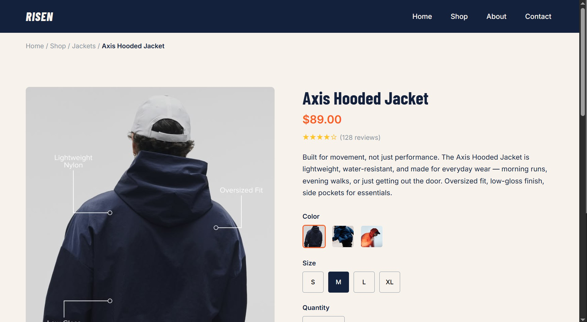

#  RISEN — Axis Hooded Jacket (Product Page)

An e-commerce product page built with HTML & CSS for **RISEN**, a fictional sportswear brand I designed — built for people who move for fun, health, or friends, not just athletes.

> "Fall. Rise. Repeat."

## 🎨 About the Brand

RISEN is built around one idea: showing up counts, even when you don't win. The brand identity (name, logo, color palette, typography, tone) was designed as a standalone case study before this page was built.

## 🧩 Sections

- Navbar
- Breadcrumbs
- Product image gallery
- Product info (name, price, rating, description)
- Size, color, and quantity selectors + Add to Cart
- Related products
- Footer

## 🛠️ Built With

- HTML5
- CSS3 (CSS Grid + Flexbox used together, as the project's core challenge)

## 📚 What I Practiced

- Combining CSS Grid (page-level layout) with Flexbox (component-level layout) in the same project
- Multi-class styling (e.g. `.size-btn.active`) to fake interactive "selected" states without JavaScript
- Semantic `<button>` vs `<a>` usage
- Structuring a real multi-part HTML page without losing track of opening/closing tags
- Git & GitHub workflow, including recovering from a messy multi-project push

## 🔗 Live Preview

 https://codewithagares.github.io/risen-product-page/
